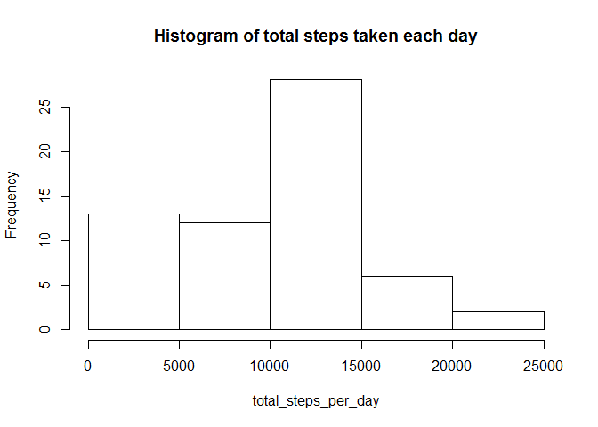
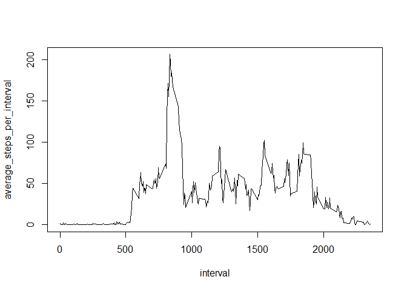
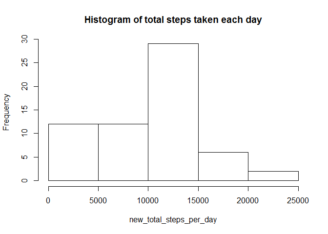
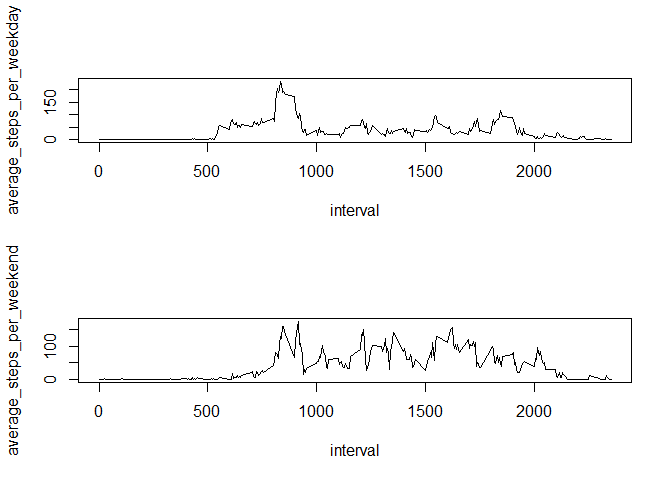

# Reproducible Research: Peer Assessment 1


## Loading and preprocessing the data

```r
activity_data = read.csv("activity.csv")
```

## What is mean total number of steps taken per day?

```r
# Use tapply to calculate the total number of steps taken per day
total_steps_per_day = tapply(activity_data$steps, list(activity_data$date), sum, na.rm = TRUE)
total_steps_per_day
```

```
## 2012-10-01 2012-10-02 2012-10-03 2012-10-04 2012-10-05 2012-10-06 
##          0        126      11352      12116      13294      15420 
## 2012-10-07 2012-10-08 2012-10-09 2012-10-10 2012-10-11 2012-10-12 
##      11015          0      12811       9900      10304      17382 
## 2012-10-13 2012-10-14 2012-10-15 2012-10-16 2012-10-17 2012-10-18 
##      12426      15098      10139      15084      13452      10056 
## 2012-10-19 2012-10-20 2012-10-21 2012-10-22 2012-10-23 2012-10-24 
##      11829      10395       8821      13460       8918       8355 
## 2012-10-25 2012-10-26 2012-10-27 2012-10-28 2012-10-29 2012-10-30 
##       2492       6778      10119      11458       5018       9819 
## 2012-10-31 2012-11-01 2012-11-02 2012-11-03 2012-11-04 2012-11-05 
##      15414          0      10600      10571          0      10439 
## 2012-11-06 2012-11-07 2012-11-08 2012-11-09 2012-11-10 2012-11-11 
##       8334      12883       3219          0          0      12608 
## 2012-11-12 2012-11-13 2012-11-14 2012-11-15 2012-11-16 2012-11-17 
##      10765       7336          0         41       5441      14339 
## 2012-11-18 2012-11-19 2012-11-20 2012-11-21 2012-11-22 2012-11-23 
##      15110       8841       4472      12787      20427      21194 
## 2012-11-24 2012-11-25 2012-11-26 2012-11-27 2012-11-28 2012-11-29 
##      14478      11834      11162      13646      10183       7047 
## 2012-11-30 
##          0
```


```r
# Use hist() to make a histogram of total steps taken each day
hist(total_steps_per_day, main ="Histogram of total steps taken each day")
```

 


```r
# Calculate mean and median of total_steps_taken_per_day
mean(total_steps_per_day)
```

```
## [1] 9354.23
```

```r
median(total_steps_per_day)
```

```
## [1] 10395
```


## What is the average daily activity pattern?

```r
# Use tapply to calculate the average (mean) number of steps taken per interval averaged across all days
average_steps_per_interval = tapply(activity_data$steps, list(activity_data$interval), mean, na.rm = TRUE)
# Create a time series plot of the 5-min interval (x-axis) and average number of steps per interval (y-axis)
plot(activity_data$interval[0:length(average_steps_per_interval)], average_steps_per_interval, type = "l", xlab = "interval")
```

 


```r
activity_data$interval[which.max(average_steps_per_interval)]
```

```
## [1] 835
```

## Inputing missing values


```r
# Calculate and report the total number of rows with NAs (i.e. count of which rows are not complete cases)
length(which(!complete.cases(activity_data)))
```

```
## [1] 2304
```

#### The strategy for inputting missing data will be to replace NAs with the corresponding interval averages


```r
# Create a new data set equal to the original data set with missing data filled in (use interval averages to replace nas)
new_activity_data = activity_data
new_activity_data$steps[!complete.cases(new_activity_data$steps)] = average_steps_per_interval[!complete.cases(new_activity_data$steps) %% 288]
```


```r
# Use tapply to calculate the new total number of steps taken per day
new_total_steps_per_day = tapply(new_activity_data$steps, list(new_activity_data$date), sum, na.rm = TRUE)

# Use hist() to make a histogram of new total steps taken each day
hist(new_total_steps_per_day, main ="Histogram of total steps taken each day")
```

 

```r
# Calculate mean and median of new_total_steps_taken_per_day
mean(new_total_steps_per_day)
```

```
## [1] 9530.724
```

```r
median(new_total_steps_per_day)
```

```
## [1] 10439
```

##### These values differ from the estimates from the first part of the assignment. Inputting missing data increased the the estimates of the total daily number of steps on average.

## Are there differences in activity patterns between weekdays and weekends?

```r
# Create a new factor variable in the dataset with two levels - "weekday"" and "weekend"" indicating whether a day is a weekday or weekend day
new_factor = weekdays(as.Date(new_activity_data$date))
new_factor[which(new_factor == "Saturday" | new_factor == "Sunday")] = "weekend"
new_factor[which(new_factor != "weekend")] = "weekday"
new_activity_data = cbind(new_activity_data, new_factor)
```


```r
# Make a panel plot for average steps taken for weekdays or weekends
weekdays_data = new_activity_data[which(new_activity_data$new_factor == "weekday"),]
average_steps_per_weekday = tapply(weekdays_data$steps, list(weekdays_data$interval), mean, na.rm = "TRUE")

weekends_data = new_activity_data[which(new_activity_data$new_factor == "weekend"),]
average_steps_per_weekend = tapply(weekends_data$steps, list(weekends_data$interval), mean, na.rm = "TRUE")

par(mfrow=c(2,1))
plot(new_activity_data$interval[0:length(average_steps_per_weekday)], average_steps_per_weekday, type = "l", xlab = "interval")
plot(new_activity_data$interval[0:length(average_steps_per_weekend)], average_steps_per_weekend, type = "l", xlab = "interval")
```

 
